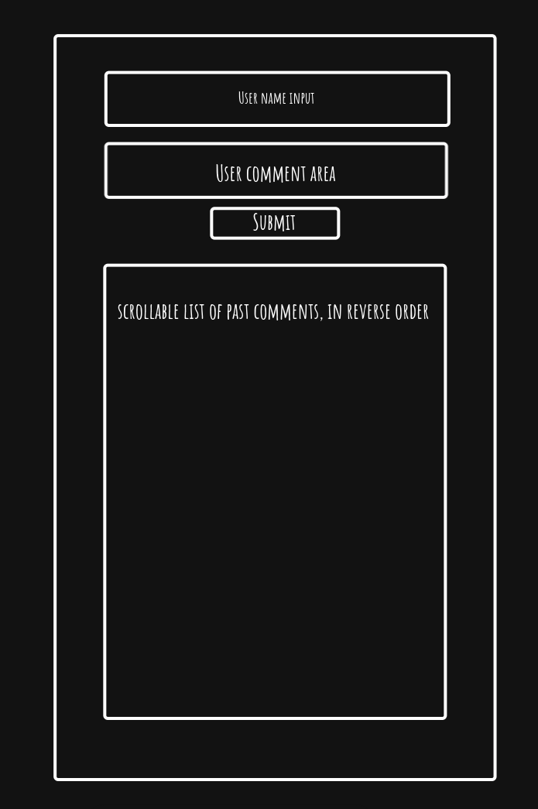

Pan Galactic Guestbook

Themed to help assessor's relentless assessing from becoming too boring.

---

    Checkpoint 1: 2025 05 22 1419

    I have created the monorepo with client and server, added basic files to the server, Including the following.

    - queries.sql - defines the table creation, I copied and pasted this into the supaBase online sql editor, dropped the table after I first created it to add quotes to the table and column names so it correctly used my capitalisation.
    - seed.js - Created a list of dummy data using an AI assistant - just the array, then used JS to place the dummy data into the database, proving the connection string and my JS code were correct.

    - added this file, and will now create the repo on github and push my work for this checkpoint.

---

    Checkpoint 2: 2025 05 22 1531

    Completed basic client, its currently complaining because the servers not been done yet, but it is reporting the form data to the console correctly, looks like I'm developing this like eating a lion bar from both ends at once!.

    CSS to follow

---

Checkpoint 3: 2025 05 23 9:15

- The server now accepts the clients post and sends it to the database, no problems here, I tested and found that I must use quotes around my table name and column names because I am using camel case for both, researching on this it would seem this issue will depend on what database system is being used, and also that it is recommended to use lower case table names, and either all upper or lower for the column names - lesson learned.
